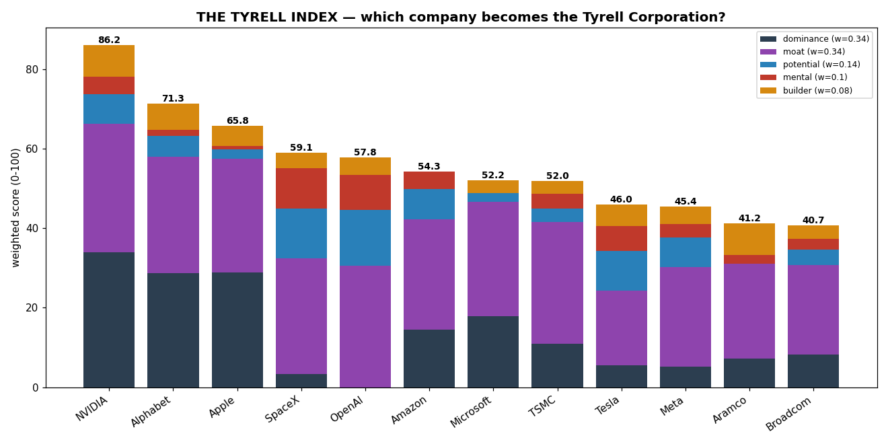
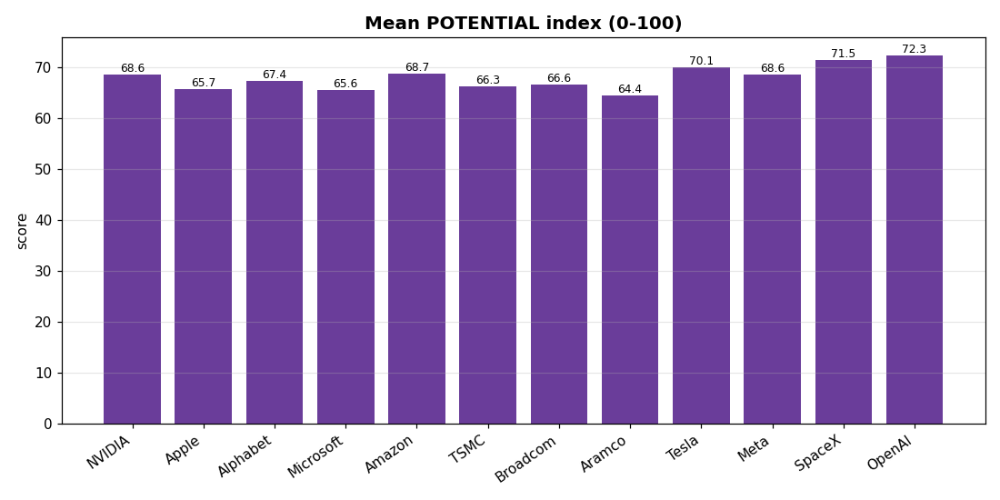
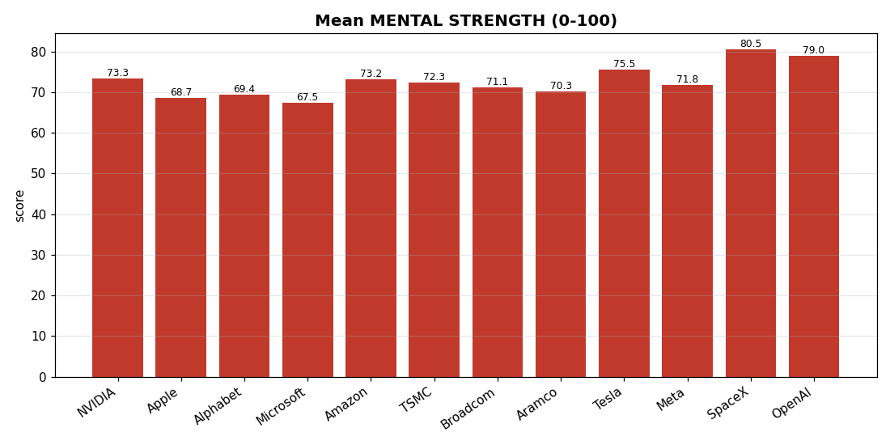
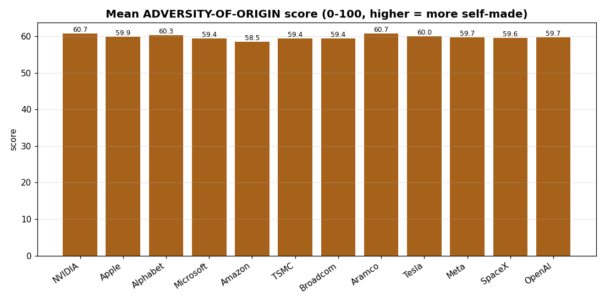
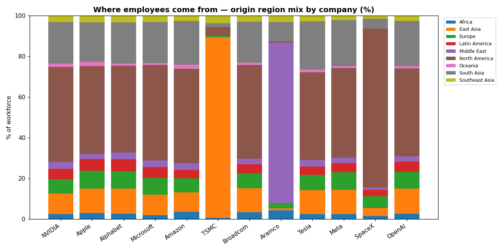
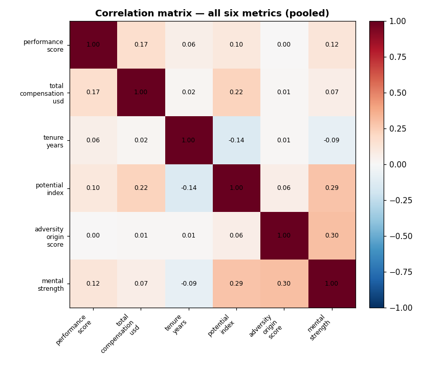

# Which of the World's Biggest Companies Becomes the *Tyrell Corporation*?

**A workforce-and-dominance study** · Prepared 2026-06-09 · **12 companies × 1,000 employees = 12,000 records** · **6 metrics** each

> **Main objective.** Predict which of the largest companies by value is most likely
> to become the **Tyrell Corporation** of our universe — not because Tyrell builds
> androids, but because it is a **globally dominant megacorporation** the world cannot
> route around. We answer it with a transparent **Tyrell Index** built from market
> dominance, strategic moat, and the *character* of each workforce.
>
> ### 🏆 Verdict: **NVIDIA** (Tyrell Index **86.2 / 100**), ahead of Alphabet (71.3) and Apple (65.8).
> The two private newcomers debut high — **SpaceX #4 (59.1)** and **OpenAI #5 (57.8)** —
> punching far above their valuation on workforce character and moat.

---

## ⚠️ Read this first — data provenance

| Part | Source | Status |
|------|--------|--------|
| The 10 public companies + market cap | [companiesmarketcap.com](https://companiesmarketcap.com/) (June 2026) | ✅ **Real, sourced** |
| OpenAI & SpaceX **private valuations** | Latest funding/tender rounds (2026) | ✅ **Real, sourced** |
| Strategic-moat scores in the Tyrell Index | Curated from public facts | 🟨 **Editorial, sourced rationale** |
| The 1,000 employees/company + all 6 per-person metrics | `scripts/generate_data.py` | ⚠️ **Synthetic** |

**On the two newcomers:** OpenAI and SpaceX are **private companies — they have no
market cap.** We use their latest *private valuations* instead (clearly flagged), and
**rank them by valuation**, where they slot in at #11–12. (SpaceX's IPO is reportedly
imminent — see §1.)

**On the employees:** no company publishes a roster of its "1,000 most important
employees" with performance, pay, tenure — let alone **potential, origins, or mental
strength**. That data does not exist, and "character" is unmeasurable for anyone, let
alone fictional people. The 12,000 records are **modelled** from distributions
calibrated to public, *company-level* traits (pay scale, seniority, turnover, hiring
geography, culture). Realistic in **shape**, reproducible (seed `20260609`), useful for
**methodology and comparison** — **not** data about real individuals.

---

## 1. The 12 companies

Ranked by value (market cap for public firms; latest private valuation for the two
private firms). USD trillions.

| Rank | Company | Ticker | Country | Sector | Ownership | Value ($T) |
|-----:|---------|--------|---------|--------|-----------|-----------:|
| 1 | NVIDIA | NVDA | 🇺🇸 USA | Semiconductors / AI | Public | 5.053 |
| 2 | Apple | AAPL | 🇺🇸 USA | Consumer Electronics | Public | 4.428 |
| 3 | Alphabet (Google) | GOOG | 🇺🇸 USA | Internet / AI | Public | 4.404 |
| 4 | Microsoft | MSFT | 🇺🇸 USA | Software / Cloud | Public | 3.058 |
| 5 | Amazon | AMZN | 🇺🇸 USA | E-commerce / Cloud | Public | 2.637 |
| 6 | TSMC | TSM | 🇹🇼 Taiwan | Semiconductor Foundry | Public | 2.213 |
| 7 | Broadcom | AVGO | 🇺🇸 USA | Semiconductors / Software | Public | 1.877 |
| 8 | Saudi Aramco | 2222.SR | 🇸🇦 Saudi Arabia | Oil & Gas | Public | 1.750 |
| 9 | Tesla | TSLA | 🇺🇸 USA | Automotive / Energy | Public | 1.535 |
| 10 | Meta Platforms | META | 🇺🇸 USA | Social / AI | Public | 1.485 |
| **11** | **SpaceX** 🔒 | — | 🇺🇸 USA | Aerospace / Satellites / AI | **Private** | **1.250** |
| **12** | **OpenAI** 🔒 | — | 🇺🇸 USA | Frontier AI | **Private** | **0.852** |

🔒 = private; figure is a private valuation, not a market cap.
**SpaceX** $1.25T reflects the post-**xAI-merger** combined entity (Feb 2026). Its IPO
is reportedly targeted for **~June 12, 2026 at $1.75–2T** — which, if priced there,
would vault it into the public top tier (≈#7). **OpenAI** $0.852T is the March 2026
Series-G valuation (up from $300B a year earlier).

---

## 2. The six metrics

Three **performance** metrics + three **character** metrics (each character metric is a
0–100 index of named sub-traits, so it's interpretable).

| # | Metric | Type | Captures |
|---|--------|------|----------|
| 1 | **Performance score** (0–100) | performance | Annual rating. |
| 2 | **Total compensation** (USD) | performance | Base + bonus + equity. |
| 3 | **Tenure** (years) | performance | Retention / institutional knowledge. |
| 4 | **Potential index** (0–100) | **character** | Learning agility + ambition + promotion *trajectory* + grit. |
| 5 | **Adversity-of-origin** (0–100) | **character** | *Where they come from*: origin region + socioeconomic background + first-gen status. Higher = more self-made. |
| 6 | **Mental strength** (0–100) | **character** | Resilience + stress tolerance + grit. |

Per-employee files: `data/employees/<rank>_<company>.csv`; combined:
`data/all_employees.csv`.

---

## 3. Company summary — performance metrics

| Company | Mean perf. | Median comp | Median tenure |
|---------|----------:|------------:|--------------:|
| NVIDIA | 81.3 | $436,900 | 6.8 yr |
| Apple | 79.2 | $380,100 | 8.4 yr |
| Alphabet | 80.4 | $409,050 | 7.6 yr |
| Microsoft | 79.0 | $380,250 | 8.2 yr |
| Amazon | 77.3 | $359,750 | 5.5 yr |
| TSMC | 81.5 | $180,300 | 9.8 yr |
| Broadcom | 78.5 | $365,450 | 7.0 yr |
| Saudi Aramco | 80.4 | $195,650 | 11.9 yr |
| Tesla | 76.2 | $311,800 | 4.8 yr |
| Meta | 79.3 | $450,250 | 5.5 yr |
| **SpaceX** | 82.3 | $245,200 | 5.0 yr |
| **OpenAI** | **83.5** | **$1,034,950** | **3.8 yr** |

> **OpenAI is the new compensation king at ~$1.03M median — 2.3× NVIDIA** — and the
> youngest workforce (3.8 yr). **SpaceX pays modestly ($245k)**, mission-over-money,
> despite the highest grit (see §4).

## 4. Company summary — character metrics

| Company | Potential | % high-pot. (≥75) | Adversity-of-origin | % first-gen | Mental strength | % high-mental (≥80) |
|---------|----------:|------------------:|--------------------:|------------:|----------------:|--------------------:|
| NVIDIA | 68.6 | 19.1% | 60.7 | 41.9% | 73.3 | 25.6% |
| Apple | 65.7 | 10.7% | 59.9 | 41.0% | 68.7 | 13.9% |
| Alphabet | 67.4 | 14.5% | 60.3 | 41.3% | 69.4 | 14.3% |
| Microsoft | 65.6 | 10.7% | 59.4 | 40.5% | 67.5 | 10.7% |
| Amazon | 68.7 | 18.9% | 58.5 | 40.5% | 73.2 | 24.0% |
| TSMC | 66.3 | 13.3% | 59.4 | 41.4% | 72.3 | 22.6% |
| Broadcom | 66.6 | 13.6% | 59.4 | 38.4% | 71.1 | 17.8% |
| Saudi Aramco | 64.4 | 9.0% | 60.7 | 40.8% | 70.3 | 16.3% |
| Tesla | 70.1 | 26.2% | 60.0 | 36.8% | 75.5 | 33.9% |
| Meta | 68.6 | 20.0% | 59.7 | 39.5% | 71.8 | 21.7% |
| **SpaceX** | 71.5 | 31.3% | 59.6 | 39.2% | **80.5** | **53.3%** |
| **OpenAI** | **72.3** | **36.4%** | 59.7 | 41.2% | 79.0 | 46.3% |

> **OpenAI and SpaceX top every character pillar.** OpenAI leads on potential (72.3,
> with 36% high-potential); **SpaceX has the strongest mental strength of all 12
> (80.5), with a majority (53%) high-grit** — consistent with its famously grueling
> mission culture.

## 5. Where they come from — origin region mix

| Company | Dominant origin region | Share |
|---------|------------------------|------:|
| TSMC | East Asia | 88.9% |
| Saudi Aramco | Middle East | 79.1% |
| **SpaceX** | **North America** (ITAR/export-control effect) | **78.2%** |
| OpenAI | North America (then South Asia 22%) | 43.2% |
| Other US firms | North America | 43–47% |

SpaceX joins TSMC and Aramco as a **"demographic island"** — but a US-concentrated one,
driven by the citizenship requirements of export-controlled aerospace work. Full table:
`data/origin_region_breakdown.csv`.

---

## 6. Visuals



| | |
|---|---|
|  |  |
|  |  |
|  |  |



---

## 7. THE TYRELL INDEX — main objective

Five pillars, combined into a 0–100 score. Dominance + moat carry most of the weight —
they *are* global dominance — while workforce character decides who **extends** the lead.

| Pillar | Weight | Measures |
|--------|-------:|----------|
| **Dominance now** | 0.34 | Value/market cap (scaled 0–100). |
| **Strategic moat** | 0.34 | Control of a critical global chokepoint (curated). |
| **Workforce potential** | 0.14 | Mean potential index. |
| **Mental strength** | 0.10 | Mean mental strength. |
| **Builder origins** | 0.08 | Mean adversity-of-origin. |

**Strategic-moat rationale:**

| Company | Moat | Why |
|---------|-----:|-----|
| NVIDIA | 95 | Controls AI compute — *the* chokepoint of the AI era. |
| TSMC | 90 | Fabricates ~all leading-edge chips; the ultimate chokepoint. |
| **OpenAI** | 90 | Frontier-model leader + ChatGPT, the consumer face of AI. |
| Alphabet | 86 | Search / ads / Android / cloud — the world's information layer. |
| **SpaceX** | 86 | Launch near-monopoly + Starlink global comms + xAI frontier AI. |
| Microsoft | 85 | Windows / Office / Azure enterprise lock-in. |
| Apple | 84 | iOS ecosystem + services across ~2.2bn devices. |
| Amazon | 82 | E-commerce + AWS, the backbone of the internet. |
| Meta | 74 | ~4bn users; the global attention chokepoint. |
| Saudi Aramco | 70 | Swing producer of world oil — declining-dependence sector. |
| Broadcom | 66 | Critical networking + custom AI silicon. |
| Tesla | 55 | Strong EV/energy brand, most contestable position. |

### Result

| Rank | Company | **Tyrell Index** | Dominance | Moat | Potential | Mental | Builder |
|-----:|---------|----------------:|----------:|-----:|----------:|-------:|--------:|
| **1** | **NVIDIA** | **86.2** | 100.0 | 95 | 53.2 | 44.6 | 100.0 |
| 2 | Alphabet | 71.3 | 84.6 | 86 | 38.0 | 14.6 | 81.8 |
| 3 | Apple | 65.8 | 85.1 | 84 | 16.5 | 9.2 | 63.6 |
| 4 | **SpaceX** 🔒 | 59.1 | 9.5 | 86 | 89.9 | 100.0 | 50.0 |
| 5 | **OpenAI** 🔒 | 57.8 | 0.0 | 90 | 100.0 | 88.5 | 54.5 |
| 6 | Amazon | 54.3 | 42.5 | 82 | 54.4 | 43.8 | 0.0 |
| 7 | Microsoft | 52.2 | 52.5 | 85 | 15.2 | 0.0 | 40.9 |
| 8 | TSMC | 52.0 | 32.4 | 90 | 24.1 | 36.9 | 40.9 |
| 9 | Tesla | 46.0 | 16.3 | 55 | 72.2 | 61.5 | 68.2 |
| 10 | Meta | 45.4 | 15.1 | 74 | 53.2 | 33.1 | 54.5 |
| 11 | Saudi Aramco | 41.2 | 21.4 | 70 | 0.0 | 21.5 | 100.0 |
| 12 | Broadcom | 40.7 | 24.4 | 66 | 27.8 | 27.7 | 40.9 |

*(Pillar columns are min-max scaled across the 12 companies.)* Full table:
`data/tyrell_index.csv`.

### Verdict & reasoning

**NVIDIA remains the most likely Tyrell Corporation (86.2/100)** even with the two
formidable newcomers added. It is the only company to top *both* heavyweight pillars at
once: **largest entity in the study** (dominance 100) **and** owner of the era's single
most important chokepoint, **AI compute** (moat 95) — and its modelled workforce has the
hungriest "builder" origins of all twelve. Whoever sells the picks and shovels of the AI
gold rush taxes everyone else's ambition; that is the shape of durable dominance.

**The story this round is the newcomers.** SpaceX (#4) and OpenAI (#5) **leapfrog
Amazon, Microsoft and TSMC** despite being the two *smallest* companies by value —
because they sweep the workforce-character pillars (OpenAI's potential = 100, SpaceX's
mental strength = 100 on the scaled axis) and carry elite moats (90 / 86). They are
**dominance in waiting**: their only weak pillar is current scale.

- **OpenAI** is the *mercenary-genius* archetype — highest pay ($1.03M), highest
  potential, frontier-AI moat — but still 6× smaller than NVIDIA, on whose chips it runs.
- **SpaceX** is the *missionary* archetype — highest grit of anyone, modest pay, a moat
  spanning launch, Starlink and (post-merger) xAI. Its **imminent IPO at $1.75–2T would
  roughly double its dominance pillar** and push it toward the Apple/Alphabet tier — the
  single most likely event to reshuffle this board.

**One-line answer:** in a world where compute is power, the company that *owns the
compute* becomes Tyrell — **NVIDIA** — with **OpenAI and SpaceX the most dangerous
challengers** the moment scale catches up to their talent.

### Sensitivity
NVIDIA leads the two dominant pillars, so it is robust to reasonable weight changes.
The live swing factor is **SpaceX's IPO**: repricing it to ~$2T lifts its dominance
pillar from 9.5 toward ~27, moving it into a near-tie with Apple for #3. Edit `WEIGHTS`
/ `STRATEGIC_MOAT` and re-run `scripts/analyze.py` to test your own assumptions.

---

## 8. Cross-company conclusions (beyond the verdict)

1. **Two opposite ways to win elite talent.** **OpenAI = mercenary** (highest pay,
   highest potential, shortest tenure — money buys genius). **SpaceX = missionary**
   (modest pay, highest grit — mission buys endurance). They sit at opposite corners of
   the pay/character map yet both top the field.
2. **Pay buys talent, not loyalty.** Across all 12, higher pay tracks *shorter* tenure
   (OpenAI 3.8 yr at $1.03M; Aramco 11.9 yr at $196k). Stability lives in the
   lower-paying, mission- or career-driven firms.
3. **Value doesn't predict pay.** TSMC (#6) pays its senior cohort the least; OpenAI
   (#12 by value) pays the most. Geography, sector and talent scarcity dominate.
4. **Character splits by culture, not size.** The intense, mission-driven cultures —
   SpaceX, OpenAI, Tesla, NVIDIA, Amazon — cluster at the top of *both* potential and
   mental strength; mature incumbents (Microsoft, Apple) sit lower. The two *smallest*
   companies lead the character table.
5. **Origins make grit (the model's strongest link).** Adversity-of-origin ↔ mental
   strength `r ≈ 0.30`; potential ↔ mental strength `r ≈ 0.29`.
6. **Three demographic islands, two logics.** TSMC (88.9% East-Asian) and Aramco (79.1%
   Middle-Eastern) reflect *national* labour markets; **SpaceX (78.2% North-American)**
   reflects *regulation* (ITAR/export control). The rest of the US firms draw ~45% North
   America, ~20% South Asia, ~11% East Asia.

---

## 9. Caveats & limitations

- **The employee data — and every character finding — is synthetic**, reflecting the
  assumptions baked into the model (e.g. "mission cultures select for grit"). It is a
  transparent framework, not a measurement of real workforces.
- **OpenAI and SpaceX are private; their figures are valuations, not market caps**, and
  move fast (SpaceX's may be obsolete the day it IPOs).
- **The Tyrell Index is an opinion expressed as arithmetic** — moat scores and weights
  are defensible editorial choices, made transparent so you can disagree and re-run.
- "Most important employees" = a seniority-weighted cohort, not any real ranking.

---

## 10. Reproduce

```bash
pip install numpy pandas matplotlib
python3 scripts/generate_data.py   # 12 companies + 12×1000 employees + combined table
python3 scripts/analyze.py         # summaries, correlations, Tyrell Index, all charts
```

**Sources:** [companiesmarketcap.com](https://companiesmarketcap.com/) ·
[Motley Fool — Largest Companies by Market Cap, June 2026](https://www.fool.com/research/largest-companies-by-market-cap/) ·
[CNBC — OpenAI $852B round](https://www.cnbc.com/2026/03/31/openai-funding-round-ipo.html) ·
[Fortune — SpaceX $800B valuation & 2026 IPO](https://fortune.com/2025/12/13/spacex-ipo-plan-2026-secondary-offering-insider-share-sale-800-billion-valuation/) ·
[Bloomberg — SpaceX targets $1.75–2T IPO](https://www.bloomberg.com/news/articles/2026-06-03/spacex-seeks-75-billion-in-ipo-at-135-per-share-reuters-says)
