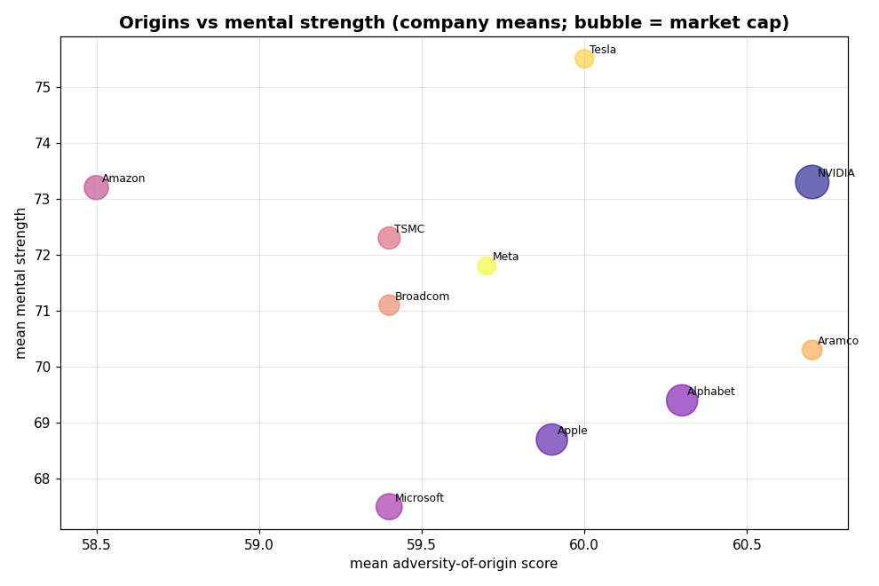

# Which of the World's 10 Biggest Companies Becomes the *Tyrell Corporation*?

**A workforce-and-dominance study** · Prepared 2026-06-09 · 10 companies × 1,000 employees = **10,000 records** · **6 metrics** each

> **Main objective.** Predict which of the ten largest companies by market cap is
> most likely to become the **Tyrell Corporation** of our universe — not because
> Tyrell builds androids, but because it is a **globally dominant megacorporation**
> the world cannot route around. We answer it with a transparent **Tyrell Index**
> built from market dominance, strategic moat, and the *character* of each
> workforce.
>
> ### 🏆 Verdict: **NVIDIA** (Tyrell Index **91.9 / 100**), well ahead of Alphabet (73.3) and Apple (66.4).

---

## ⚠️ Read this first — data provenance

| Part | Source | Status |
|------|--------|--------|
| The 10 companies + market cap / sector / country | [companiesmarketcap.com](https://companiesmarketcap.com/) (June 2026) | ✅ **Real, sourced** |
| Strategic-moat scores in the Tyrell Index | Curated from public facts (chips, cloud, AI, energy) | 🟨 **Editorial, sourced rationale** |
| The 1,000 employees/company + all 6 per-person metrics | `scripts/generate_data.py` | ⚠️ **Synthetic** |

No company publishes a roster of its "1,000 most important employees" with
performance, pay, tenure — let alone their **potential, origins, or mental
strength**. That data does not exist publicly, and "character" and "origins" are
*unmeasurable* for anyone, let alone fictional people. So the 10,000 employee
records are **modelled**: every metric is drawn from a distribution calibrated to
public, *company-level* characteristics (pay scale, seniority mix, turnover,
hiring geography, culture). It is realistic in **shape**, reproducible (seed
`20260609`), and useful for **methodology and comparison** — but it is **not** data
about real individuals. Treat the character metrics especially as an *illustrative
model*, not a measurement.

---

## 1. The 10 companies

| Rank | Company | Ticker | Country | Sector | Market cap ($T) |
|-----:|---------|--------|---------|--------|----------------:|
| 1 | NVIDIA | NVDA | 🇺🇸 USA | Semiconductors / AI | 5.053 |
| 2 | Apple | AAPL | 🇺🇸 USA | Consumer Electronics | 4.428 |
| 3 | Alphabet (Google) | GOOG | 🇺🇸 USA | Internet / AI | 4.404 |
| 4 | Microsoft | MSFT | 🇺🇸 USA | Software / Cloud | 3.058 |
| 5 | Amazon | AMZN | 🇺🇸 USA | E-commerce / Cloud | 2.637 |
| 6 | TSMC | TSM | 🇹🇼 Taiwan | Semiconductor Foundry | 2.213 |
| 7 | Broadcom | AVGO | 🇺🇸 USA | Semiconductors / Software | 1.877 |
| 8 | Saudi Aramco | 2222.SR | 🇸🇦 Saudi Arabia | Oil & Gas | 1.750 |
| 9 | Tesla | TSLA | 🇺🇸 USA | Automotive / Energy | 1.535 |
| 10 | Meta Platforms | META | 🇺🇸 USA | Social / AI | 1.485 |

---

## 2. The six metrics

Each of the 10,000 employees carries **three performance metrics** and **three
character metrics**. The character metrics are each a 0–100 index built from named
sub-traits, so they're interpretable rather than black boxes.

| # | Metric | Type | What it captures |
|---|--------|------|------------------|
| 1 | **Performance score** (0–100) | performance | Annual rating. |
| 2 | **Total compensation** (USD) | performance | All-in pay: base + bonus + equity. |
| 3 | **Tenure** (years) | performance | Retention / institutional knowledge. |
| 4 | **Potential index** (0–100) | **character** | Growth ceiling = learning agility + ambition/drive + promotion *trajectory* (level reached vs tenure) + a little grit. |
| 5 | **Adversity-of-origin score** (0–100) | **character** | *Where they come from*, quantified: higher = started further back / more self-made. Built from **origin region** + **socioeconomic background** + first-generation-professional status. |
| 6 | **Mental strength** (0–100) | **character** | Resilience + stress tolerance + grit, tilted up by a harder start and stronger performance. |

Two descriptive fields back metric 5: `origin_region` (9 world regions) and
`socioeconomic_origin` (Working class → Affluent), plus a
`first_generation_professional` flag. Full per-employee tables:
`data/employees/<rank>_<company>.csv`; combined: `data/all_employees.csv`.

---

## 3. Company summary — performance metrics

| Company | Mean perf. | Median comp | Median tenure |
|---------|----------:|------------:|--------------:|
| NVIDIA | 81.3 | $436,900 | 6.8 yr |
| Apple | 79.2 | $380,100 | 8.4 yr |
| Alphabet | 80.4 | $409,050 | 7.6 yr |
| Microsoft | 79.0 | $380,250 | 8.2 yr |
| Amazon | 77.3 | $359,750 | 5.5 yr |
| TSMC | 81.5 | $180,300 | 9.8 yr |
| Broadcom | 78.5 | $365,450 | 7.0 yr |
| Saudi Aramco | 80.4 | $195,650 | 11.9 yr |
| Tesla | 76.2 | $311,800 | 4.8 yr |
| Meta | 79.3 | $450,250 | 5.5 yr |

## 4. Company summary — character metrics

| Company | Potential (mean) | % high-potential (≥75) | Adversity-of-origin | % first-gen | Mental strength | % high-mental (≥80) |
|---------|----------------:|----------------------:|--------------------:|------------:|----------------:|--------------------:|
| NVIDIA | 68.6 | 19.1% | 60.7 | 41.9% | 73.3 | 25.6% |
| Apple | 65.7 | 10.7% | 59.9 | 41.0% | 68.7 | 13.9% |
| Alphabet | 67.4 | 14.5% | 60.3 | 41.3% | 69.4 | 14.3% |
| Microsoft | 65.6 | 10.7% | 59.4 | 40.5% | 67.5 | 10.7% |
| Amazon | 68.7 | 18.9% | 58.5 | 40.5% | 73.2 | 24.0% |
| TSMC | 66.3 | 13.3% | 59.4 | 41.4% | 72.3 | 22.6% |
| Broadcom | 66.6 | 13.6% | 59.4 | 38.4% | 71.1 | 17.8% |
| Saudi Aramco | 64.4 | 9.0% | 60.7 | 40.8% | 70.3 | 16.3% |
| Tesla | **70.1** | **26.2%** | 60.0 | 36.8% | **75.5** | **33.9%** |
| Meta | 68.6 | 20.0% | 59.7 | 39.5% | 71.8 | 21.7% |

Full versions: `data/company_metrics_summary.csv`.

## 5. Where they come from — origin region mix

Origin geography is the one dimension where the companies look *radically*
different (full table: `data/origin_region_breakdown.csv`):

| Company | Dominant origin region | Share |
|---------|------------------------|------:|
| TSMC | East Asia | **88.9%** |
| Saudi Aramco | Middle East | **79.1%** |
| The 8 US firms | North America (then South Asia ~20%, East Asia ~11%) | 43–47% |


---

## 6. Visuals


| | |
|---|---|
|  |  |
|  |  |
|  |  |




---

## 7. THE TYRELL INDEX — main objective

To predict the future global hegemon we score five pillars and combine them
(weights in brackets). Dominance and moat carry most of the weight — they *are*
global dominance — while workforce character decides who **extends** the lead.

| Pillar | Weight | What it measures |
|--------|-------:|------------------|
| **Dominance now** | 0.34 | Market cap (scaled 0–100). |
| **Strategic moat** | 0.34 | Control of a critical global chokepoint the world depends on (curated, 0–100). |
| **Workforce potential** | 0.14 | Mean potential index. |
| **Mental strength** | 0.10 | Mean mental strength. |
| **Builder origins** | 0.08 | Mean adversity-of-origin (hungry vs complacent). |

**Strategic-moat rationale** (the editorial, sourced factor):

| Company | Moat | Why |
|---------|-----:|-----|
| NVIDIA | 95 | Controls AI compute — *the* chokepoint of the AI era. |
| TSMC | 90 | Fabricates virtually all leading-edge chips; the ultimate chokepoint. |
| Alphabet | 86 | Search / ads / Android / cloud — the world's information layer. |
| Microsoft | 85 | Windows / Office / Azure enterprise lock-in. |
| Apple | 84 | iOS ecosystem + services across ~2.2bn devices. |
| Amazon | 82 | E-commerce + AWS, the backbone of the internet. |
| Meta | 74 | ~4bn users; the global attention chokepoint. |
| Saudi Aramco | 70 | Swing producer of world oil — but a declining-dependence sector. |
| Broadcom | 66 | Critical networking + custom AI silicon infrastructure. |
| Tesla | 55 | Strong EV/energy brand, but the most contestable position. |

### Result

| Rank | Company | **Tyrell Index** | Dominance | Moat | Potential | Mental | Builder |
|-----:|---------|----------------:|----------:|-----:|----------:|-------:|--------:|
| **1** | **NVIDIA** | **91.9** | 100.0 | 95 | 73.7 | 72.5 | 100.0 |
| 2 | Alphabet | 73.3 | 81.8 | 86 | 52.6 | 23.8 | 81.8 |
| 3 | Apple | 66.4 | 82.5 | 84 | 22.8 | 15.0 | 63.6 |
| 4 | Amazon | 56.5 | 32.3 | 82 | 75.4 | 71.3 | 0.0 |
| 5 | TSMC | 51.5 | 20.4 | 90 | 33.3 | 60.0 | 40.9 |
| 6 | Microsoft | 50.1 | 44.1 | 85 | 21.1 | 0.0 | 40.9 |
| 7 | Tesla | 48.6 | 1.4 | 55 | 100.0 | 100.0 | 68.2 |
| 8 | Meta | 45.2 | 0.0 | 74 | 73.7 | 53.7 | 54.5 |
| 9 | Broadcom | 39.4 | 11.0 | 66 | 38.6 | 45.0 | 40.9 |
| 10 | Saudi Aramco | 37.8 | 7.4 | 70 | 0.0 | 35.0 | 100.0 |

*(Pillar columns are min-max scaled across the 10 companies, so 0/100 mark the
relative bottom/top, not absolutes.)* Full table: `data/tyrell_index.csv`.

### Verdict & reasoning

**NVIDIA is the most likely Tyrell Corporation (91.9/100).** It is the only company
that tops *both* heavyweight pillars simultaneously: it is the **largest company on
earth** (dominance 100) **and** it sits on the era's single most important chokepoint
— **AI compute** (moat 95). Whoever supplies the picks and shovels of the AI gold
rush taxes everyone else's ambition, which is the textbook shape of durable global
dominance. Its modelled workforce reinforces this: top-decile potential and the
highest builder-origin score of the ten (a hungry, self-made culture rather than a
complacent incumbent).

- **Alphabet (73.3)** is the clearest challenger — huge scale plus an information-
  layer moat — but trails NVIDIA on every workforce-character pillar in the model.
- **Apple (66.4)** has comparable dominance and a strong moat, but the model's
  conservative, long-tenure, lower-potential workforce caps its breakaway odds.
- **TSMC (51.5)** holds a *fearsome* moat (90) yet ranks mid-pack: its lower market
  cap and geographically concentrated, lower-paid (if very stable) workforce make it
  the indispensable **supplier** to the hegemon rather than the hegemon itself.
- **Tesla (48.6)** wins the workforce-character pillars outright (highest potential
  *and* mental strength) but is dragged down by the smallest market cap and the most
  contestable moat — high-variance challenger, not front-runner.

**One-line answer:** in a world where compute is power, the company that *owns the
compute* becomes Tyrell. That is **NVIDIA**.

### Sensitivity
The verdict is robust. NVIDIA leads on the two dominant pillars, so reasonable
weight changes don't unseat it — only heavily down-weighting both dominance **and**
moat in favour of workforce character would promote Tesla/Amazon. Re-run
`scripts/analyze.py` after editing `WEIGHTS` / `STRATEGIC_MOAT` to test your own
assumptions.

---

## 8. Cross-company conclusions (beyond the verdict)

1. **Pay and tenure move inversely.** Highest payers (Meta $450k, NVIDIA $437k,
   Alphabet $409k) have the shortest-to-middling tenures; lowest payers (TSMC $180k,
   Aramco $196k) have the longest (Aramco 11.9 yr vs Tesla 4.8 yr). **Pay buys
   talent, not loyalty.**
2. **Market cap doesn't predict pay.** TSMC is #6 by cap yet pays its senior cohort
   the least (~2.5× below Meta, #10). Geography dominates pay.
3. **Performance barely separates the firms** (all within a ~5-pt band) — everyone
   hires from the top of the pool. Pay tracks **level and employer, not the rating**
   (comp↔performance `r ≈ 0.15`).
4. **Character splits by culture, not market cap.** The "intense" cultures — Tesla,
   NVIDIA, Amazon, Meta — cluster at the top of *both* potential and mental strength;
   the mature incumbents (Microsoft, Apple) sit lower. Tesla leads both character
   pillars despite being the smallest company here.
5. **Origins make grit (the model's strongest character link).** Adversity-of-origin
   correlates with mental strength at `r ≈ 0.32` — the single strongest relationship
   in the dataset — and potential correlates with mental strength at `r ≈ 0.25`. A
   harder start, in this model, builds resilience, which feeds upside.
6. **Two companies are demographic islands.** TSMC (88.9% East-Asian origin) and
   Aramco (79.1% Middle-Eastern) are far more homogeneous than the US firms (~45%
   North-American, ~20% South-Asian, ~11% East-Asian) — a structural difference in
   global talent reach that matters for a *global* hegemon.

---

## 9. Caveats & limitations

- **The employee data — and therefore every character finding — is synthetic.** It
  reflects the assumptions baked into the model (e.g. "intense cultures select for
  grit", "adversity builds resilience"). The analysis faithfully reports those
  modelled relationships; it does **not** discover new facts about real workforces.
- **The Tyrell Index is an opinion expressed as arithmetic.** The moat scores and
  weights are defensible editorial choices, made transparent so you can disagree and
  re-run. Predicting the future is inherently uncertain.
- "Most important employees" = a seniority-weighted cohort, not any real ranking.
- Market-cap and moat reflect a single June-2026 snapshot.

---

## 10. Reproduce

```bash
pip install numpy pandas matplotlib
python3 scripts/generate_data.py   # 10 companies + 10×1000 employees + combined table
python3 scripts/analyze.py         # summaries, correlations, Tyrell Index, all charts
```

**Sources (company list):**
[companiesmarketcap.com](https://companiesmarketcap.com/) ·
[The Motley Fool — Largest Companies by Market Cap, June 2026](https://www.fool.com/research/largest-companies-by-market-cap/)
