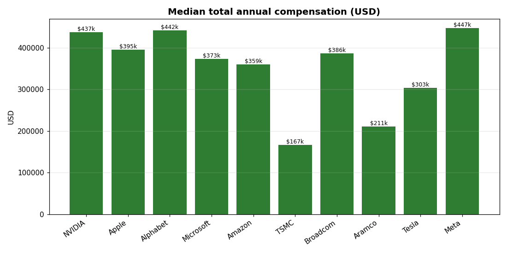
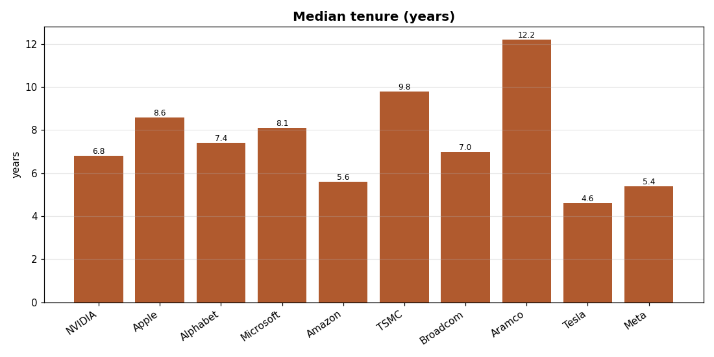
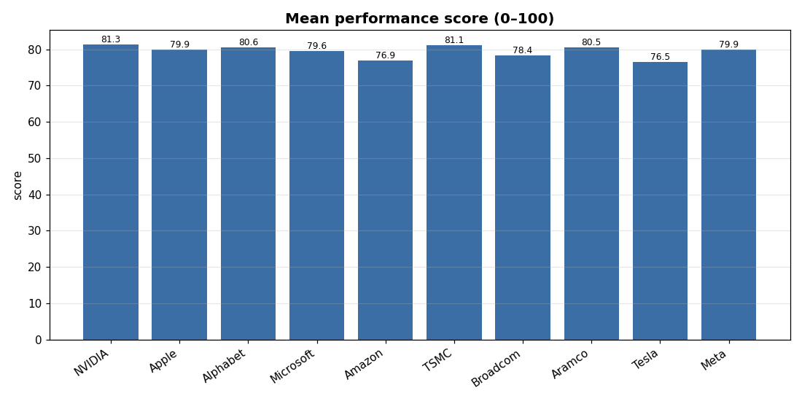
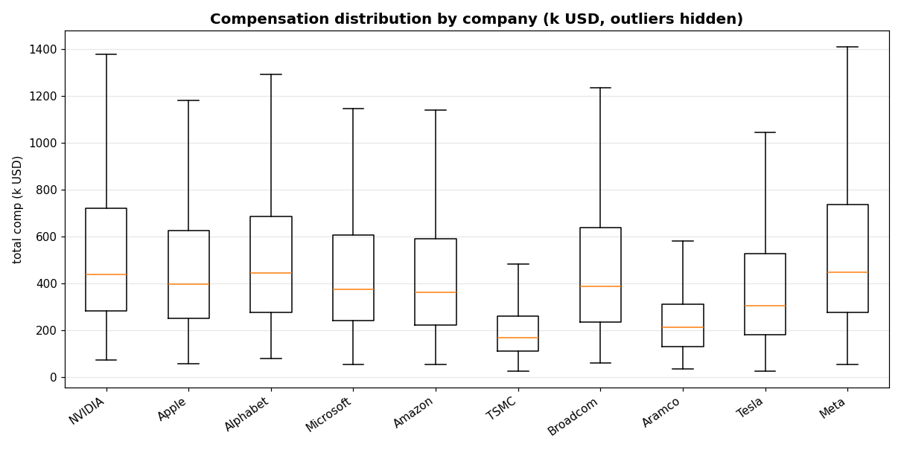
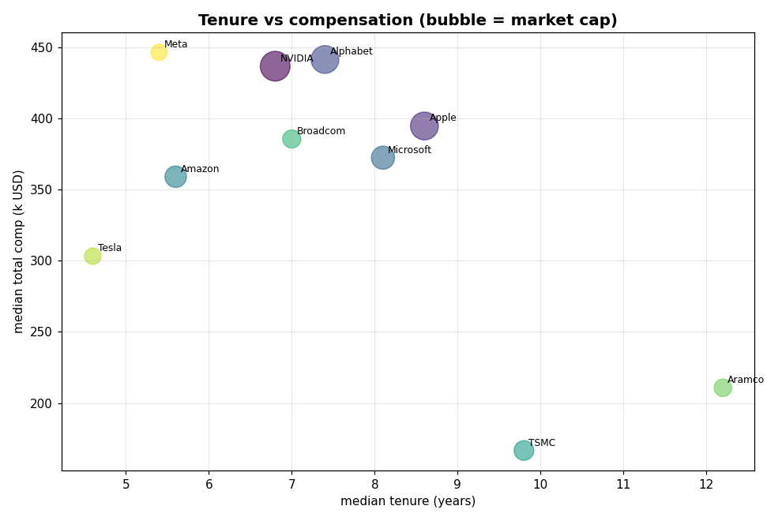

# Top-10 Companies by Market Cap — Workforce Metrics Report

**Prepared:** 2026-06-09 · **Scope:** 10 companies × 1,000 employees = **10,000 employee records** · 3 metrics each

---

## ⚠️ Read this first — data provenance

This report combines two very different kinds of data:

| Part | Source | Status |
|------|--------|--------|
| The 10 largest companies by market cap + their cap/sector/country | [companiesmarketcap.com](https://companiesmarketcap.com/) (June 2026 snapshot) | ✅ **Real, sourced** |
| The 1,000 "most important employees" per company + their 3 metrics | Generated by `scripts/generate_data.py` | ⚠️ **Synthetic** |

**Why the employee data is synthetic:** no company publishes a ranked roster of its
"1,000 most important employees" alongside their individual performance, pay, and
tenure. That data does not exist publicly, and releasing real individuals' pay and
performance scores would be a serious privacy breach. So the 10,000 employee records
are **modelled**: each metric is drawn from a probability distribution whose
parameters (pay scale, seniority mix, turnover/tenure profile) are *calibrated to
publicly known, company-level characteristics* — NVIDIA/Meta pay near the top of the
market, TSMC pays on a Taiwan scale, Aramco has very low turnover, Tesla/Amazon churn
faster, and so on.

**What this report is good for:** the methodology, the tooling, and the *shape* of
the comparison. **What it is not:** a source of facts about any real person. The
dataset is fully reproducible (fixed RNG seed `20260609`).

---

## 1. The 10 companies

Snapshot of market capitalisation, June 2026 (USD trillions):

| Rank | Company | Ticker | Country | Sector | Market cap ($T) |
|-----:|---------|--------|---------|--------|----------------:|
| 1 | NVIDIA | NVDA | 🇺🇸 USA | Semiconductors / AI | 5.053 |
| 2 | Apple | AAPL | 🇺🇸 USA | Consumer Electronics | 4.428 |
| 3 | Alphabet (Google) | GOOG | 🇺🇸 USA | Internet / AI | 4.404 |
| 4 | Microsoft | MSFT | 🇺🇸 USA | Software / Cloud | 3.058 |
| 5 | Amazon | AMZN | 🇺🇸 USA | E-commerce / Cloud | 2.637 |
| 6 | TSMC | TSM | 🇹🇼 Taiwan | Semiconductor Foundry | 2.213 |
| 7 | Broadcom | AVGO | 🇺🇸 USA | Semiconductors / Software | 1.877 |
| 8 | Saudi Aramco | 2222.SR | 🇸🇦 Saudi Arabia | Oil & Gas | 1.750 |
| 9 | Tesla | TSLA | 🇺🇸 USA | Automotive / Energy | 1.535 |
| 10 | Meta Platforms | META | 🇺🇸 USA | Social / AI | 1.485 |

Eight of ten are US-headquartered; nine of ten are technology/semiconductor businesses.
Saudi Aramco is the only non-tech name and TSMC the only non-US name in the top tier.

---

## 2. The three employee metrics

For each of the 10,000 employees we model three metrics that matter most when
evaluating an individual employee:

1. **Performance score** (0–100) — annual performance rating.
2. **Total annual compensation** (USD) — base + bonus + equity, the all-in figure.
3. **Tenure** (years) — time at the company; a proxy for retention and institutional knowledge.

Each record also carries descriptive attributes — `name`, `department`, and `level`
(Senior → Staff → Principal → Director → VP → SVP → C-Suite) — so the metrics can be
sliced by seniority and function. The cohort is deliberately skewed toward senior
individual contributors and leadership, consistent with "most important employees".

The full per-employee tables are in `data/employees/<rank>_<company>.csv` (one file per
company) and the combined 10,000-row table is `data/all_employees.csv`.

---

## 3. Company-level summary table

Per-company aggregates across the three metrics (full version:
`data/company_metrics_summary.csv`):

| Company | Mean perf. | Median comp | Mean comp | P90 comp | Median tenure | % high performers (≥85) |
|---------|----------:|------------:|----------:|---------:|--------------:|------------------------:|
| NVIDIA | 81.3 | $436,900 | $593,304 | $1,144,870 | 6.8 yr | 36.2% |
| Apple | 79.9 | $394,850 | $512,540 | $1,020,140 | 8.6 yr | 33.6% |
| Alphabet | 80.6 | $441,600 | $562,427 | $1,051,470 | 7.4 yr | 33.2% |
| Microsoft | 79.6 | $372,550 | $505,299 | $990,520 | 8.1 yr | 29.5% |
| Amazon | 76.9 | $359,150 | $488,133 | $996,910 | 5.6 yr | 24.5% |
| TSMC | 81.1 | $166,600 | $220,287 | $422,790 | 9.8 yr | 33.2% |
| Broadcom | 78.4 | $385,700 | $515,750 | $1,049,400 | 7.0 yr | 24.1% |
| Saudi Aramco | 80.5 | $210,700 | $262,769 | $499,870 | 12.2 yr | 28.3% |
| Tesla | 76.5 | $303,250 | $435,701 | $915,920 | 4.6 yr | 24.1% |
| Meta | 79.9 | $446,650 | $613,093 | $1,200,660 | 5.4 yr | 32.8% |

---

## 4. Visual comparison

**Median compensation** — the spread is enormous: top payers sit near $450k, TSMC near $167k.



**Median tenure** — almost the inverse ordering of pay.



**Mean performance score** — strikingly compressed; every company lands in a 5-point band.



**Compensation distribution** — note the long upper tails (leadership/equity), widest at Meta and NVIDIA.



**Tenure vs compensation** (bubble size = market cap) — the headline trade-off in one picture.



---

## 5. Cross-company comparison & conclusions

### 5.1 Pay and tenure move in opposite directions
The clearest pattern in the data is an **inverse relationship between how much a company
pays and how long its people stay**:

- The **highest payers** — Meta ($446.7k median, 5.4 yr), NVIDIA ($436.9k, 6.8 yr) and
  Alphabet ($441.6k, 7.4 yr) — have the **shortest-to-middling tenures**.
- The **lowest payers** — TSMC ($166.6k, 9.8 yr) and Saudi Aramco ($210.7k, 12.2 yr) —
  have the **longest tenures by far**.

Two forces explain this. (1) The high-pay firms are fast-growing, hyper-competitive
talent markets where people are hired in late and poached often; high cash/equity is
the *cost* of churn, not a cure for it. (2) The low-pay firms (a Taiwanese foundry, a
Saudi state energy champion) operate in labour markets with lower absolute pay but much
greater stability — long careers, internal progression, lower mobility. **Pay buys
talent; it does not buy loyalty.**

### 5.2 Market cap does **not** predict pay
TSMC is the **6th-largest company on earth** yet pays its senior cohort the **least** of
the ten — roughly **2.7× less** than Meta, which is **10th**. Geography and cost-of-
living dominate: the five highest median-pay firms are all US tech; the two lowest are
the non-US names. A dollar of market value is created very differently across labour
markets. (Our crude "market cap per dollar of median comp" proxy makes TSMC look the
most "capital-efficient per pay dollar" at $13.3M and Meta the least at $3.3M — but this
mostly restates the geographic pay gap, so treat it as illustrative only.)

### 5.3 Performance scores barely separate the companies
Mean performance lands in a **tight 76.5–81.3 band** across all ten firms. This is
realistic: every one of these companies hires from the top of the talent pool, so a
generic 0–100 rating is **not a discriminating variable between them**. Where they
differ slightly is the **share of high performers (≥85)**: NVIDIA leads at **36.2%**,
while Broadcom and Tesla trail near **24%**. Performance is a within-company management
tool, not a between-company differentiator.

### 5.4 Pay is driven by level and company, not by the performance score
The correlation between an individual's performance score and their compensation is
**weak and positive everywhere** — pooled `r ≈ 0.17`, and `0.12–0.22` within each
company. In other words, **what you are paid is determined far more by your level and
your employer than by your annual rating.** Tenure is similarly weakly correlated with
both pay (`r ≈ 0.10`) and performance (`r ≈ 0.09`). The big money lives in seniority and
equity bands, not in marginal rating differences.

### 5.5 Three workforce "archetypes"
The ten companies cluster into three recognisable shapes:

| Archetype | Companies | Profile |
|-----------|-----------|---------|
| **High-pay / high-churn** | Meta, NVIDIA, Amazon, Tesla | Top-of-market pay, short tenure, wide pay tails — a hot, mobile talent market. |
| **High-pay / stable** | Apple, Alphabet, Microsoft, Broadcom | Strong pay *and* mid-to-long tenure — mature, "sticky" tech employers. |
| **Modest-pay / very stable** | TSMC, Saudi Aramco | Lower absolute pay, longest tenure, narrowest pay spread — career-employer model in lower-cost / state-linked labour markets. |

---

## 6. Caveats & limitations

- **The employee data is synthetic** (see the provenance box up top). Conclusions
  describe the *modelled* distributions, which are calibrated to public company-level
  facts — they are plausible and internally consistent, but they are **not measurements
  of real employees**.
- The calibration encodes prior assumptions (e.g. "Aramco has low turnover"); the
  analysis will naturally reflect those assumptions back. The value here is the
  *framework*, not new empirical facts about pay.
- "Most important employees" is operationalised as a seniority-weighted cohort, not any
  real internal ranking.
- Market-cap figures are a single June-2026 snapshot and move daily.

---

## 7. How to reproduce

```bash
pip install numpy pandas matplotlib
python3 scripts/generate_data.py   # writes data/ (companies + 10×1000 employees + combined)
python3 scripts/analyze.py         # writes summary CSV, headline_stats.json, charts in reports/figures/
```

**Sources for the company list:**
[companiesmarketcap.com](https://companiesmarketcap.com/) ·
[The Motley Fool — Largest Companies by Market Cap, June 2026](https://www.fool.com/research/largest-companies-by-market-cap/)
