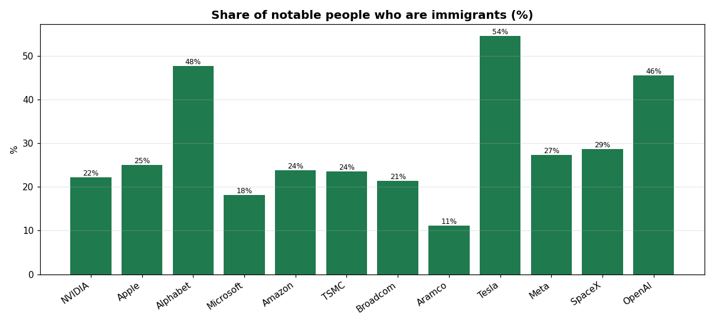
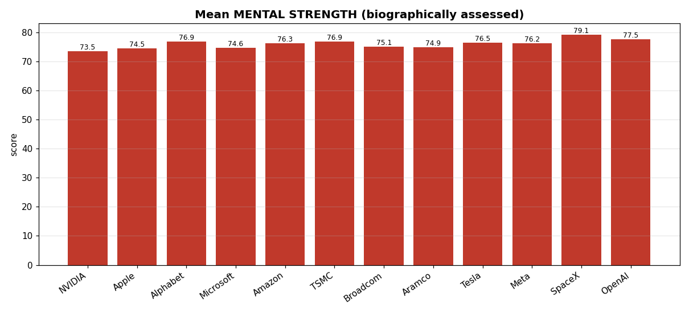
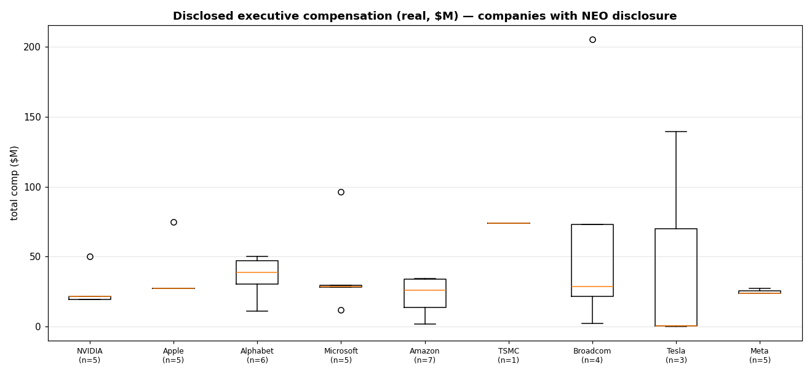

# Which of the World's Biggest Companies Becomes the *Tyrell Corporation*?
### A study of **real, named leaders** of the 12 largest tech/energy companies

**Prepared:** 2026-06-09 · **216 real, individually-sourced people** across **12 companies** · 6 metrics

> **Objective.** Predict which company is most likely to become the **Tyrell Corporation**
> of our universe — the **globally dominant megacorporation** the world cannot route
> around (dominant, *not* robot-building). Answered with a transparent **Tyrell Index**
> built from market dominance, strategic moat, and the *character* of each company's
> real leadership.
>
> ### 🏆 Verdict: **NVIDIA** (Tyrell Index **88.7 / 100**), ahead of Alphabet (82.6) and Apple (81.0).

---

## ⚠️ Read this first — data provenance (this version is REAL)

Unlike earlier synthetic drafts, **the people in this study are real and individually
sourced.** Each of the 216 records is a genuine, publicly-documented individual —
founders, executives, board members, and marquee technical leaders — with facts drawn
from SEC proxy statements, official company pages, Wikipedia, and reputable press. Full
source lists are in **`reports/PROFILES.md`**.

| Field | Status |
|-------|--------|
| Names, titles, origins, education, career, year joined | ✅ **Real, sourced** |
| **Total compensation** (41 people) | ✅ **Real** — actual disclosed figures for *named executive officers* in proxy statements |
| The 3 **character** indices (potential / mental strength / adversity-of-origin) | 🟨 **Interpretive** — derived from each person's *documented public biography* via one consistent rubric (see §2). Not psychometric measurements. |
| Strategic-moat scores (Tyrell Index) | 🟨 **Editorial**, from public facts |

**Two honest limits.** (1) "1,000 employees per company" does not exist publicly — no
firm publishes employee rosters with personal data, so this is the *publicly-documented
leadership set* (11–22 people/company), not a random sample. (2) Compensation is only
public for **named executive officers**; for everyone else, and for the private firms
(OpenAI, SpaceX) and non-US-style disclosers (Saudi Aramco, TSMC), it is blank rather
than guessed.

---

## 1. The 12 companies

| Rank | Company | Country | Ownership | Value ($T) | People documented |
|-----:|---------|---------|-----------|-----------:|------------------:|
| 1 | NVIDIA | 🇺🇸 USA | Public | 5.053 | 18 |
| 2 | Apple | 🇺🇸 USA | Public | 4.428 | 16 |
| 3 | Alphabet (Google) | 🇺🇸 USA | Public | 4.404 | 21 |
| 4 | Microsoft | 🇺🇸 USA | Public | 3.058 | 22 |
| 5 | Amazon | 🇺🇸 USA | Public | 2.637 | 21 |
| 6 | TSMC | 🇹🇼 Taiwan | Public | 2.213 | 17 |
| 7 | Broadcom | 🇺🇸 USA | Public | 1.877 | 14 |
| 8 | Saudi Aramco | 🇸🇦 Saudi Arabia | Public | 1.750 | 18 |
| 9 | Tesla | 🇺🇸 USA | Public | 1.535 | 11 |
| 10 | Meta Platforms | 🇺🇸 USA | Public | 1.485 | 22 |
| 11 | SpaceX 🔒 | 🇺🇸 USA | Private | 1.250 | 14 |
| 12 | OpenAI 🔒 | 🇺🇸 USA | Private | 0.852 | 22 |

🔒 private (valuation, not market cap). Full per-company tables: `data/people/`; combined:
`data/all_people.csv`.

---

## 2. The six metrics

Three **performance/fact** metrics + three **character** metrics:

| # | Metric | Type | Source |
|---|--------|------|--------|
| 1 | **Role / title & seniority** | fact | official |
| 2 | **Total compensation** (USD) | fact | proxy disclosure (NEOs only) |
| 3 | **Origin & tenure** (where they come from; year joined) | fact | bios |
| 4 | **Potential index** (0–100) | character | rubric ↓ |
| 5 | **Adversity-of-origin** (0–100) | character | rubric ↓ |
| 6 | **Mental strength** (0–100) | character | rubric ↓ |

**Character rubric** (applied consistently; each score cites the documented fact that drives it):

- **Adversity-of-origin** — from documented upbringing. Refugee / fled persecution /
  working-class / teen-single-mother / housing-project origins → **80–95**; immigrant or
  first-generation / rural working-class → **60–80**; ordinary professional family, none
  documented → **40–55**; privileged/dynastic (e.g. an Agnelli or Pritzker heir) → **20–35**.
- **Mental strength** — from documented resilience. Founder who survived a near-death
  crisis / public ousting-and-comeback / combat veteran / extreme documented adversity →
  **85–95**; long high-pressure founder/CEO tenure → **78–90**; senior exec → **62–78**.
- **Potential** — ceiling/influence/trajectory. Iconic founder-CEO or Nobel/Turing-level
  figure → **90–100**; division CEO / co-founder / top researcher → **78–90**; C-suite →
  **68–84**; established director → **58–80**.

These are **interpretive assessments of public figures from the public record** — fair
commentary, but subjective. They are clearly *not* measurements.

---

## 3. Company summary

| Company | People | % immigrant | % w/ documented adversity | Potential | Mental | Adversity-origin | Median disclosed comp |
|---------|------:|-----------:|--------------------------:|----------:|-------:|-----------------:|----------------------:|
| NVIDIA | 18 | 22% | 28% | 77.5 | 73.5 | 52.6 | $21.4M |
| Apple | 16 | 25% | 38% | 79.0 | 74.5 | 51.7 | $27.1M |
| Alphabet | 21 | **48%** | **62%** | 82.4 | 76.9 | **56.4** | $38.6M |
| Microsoft | 22 | 18% | 18% | 79.4 | 74.6 | 49.0 | $28.3M |
| Amazon | 21 | 24% | 24% | 81.0 | 76.3 | 51.6 | $25.7M |
| TSMC | 17 | 24% | 29% | 80.9 | 76.9 | 56.2 | $74M* |
| Broadcom | 14 | 21% | 29% | 78.7 | 75.1 | 53.1 | $28.4M |
| Saudi Aramco | 18 | **11%** | 17% | 78.8 | 74.9 | 50.9 | n/d |
| Tesla | 11 | **55%** | 46% | 80.2 | 76.5 | 52.7 | $0.4M† |
| Meta | 22 | 27% | 36% | 81.5 | 76.2 | 49.2 | $23.6M |
| SpaceX | 14 | 29% | 29% | 82.0 | **79.1** | 51.3 | n/d (private) |
| OpenAI | 22 | 46% | 59% | **83.9** | 77.5 | 53.3 | n/d (private) |

\* TSMC: only C.C. Wei's pay is public (FY2024 ≈ NT$2.42B ≈ ~$74M). † Tesla median is low
because the three NEOs are Musk ($0), Zhu ($376k) and CFO Taneja ($139.5M). n/d = not
disclosed. Full table: `data/company_people_summary.csv`.

---

## 4. Visuals


| | |
|---|---|
|  |  |
|  |  |




---

## 5. THE TYRELL INDEX

| Pillar | Weight | Source |
|--------|-------:|--------|
| **Dominance now** | 0.34 | valuation ÷ largest (NVIDIA) × 100 |
| **Strategic moat** | 0.34 | curated control-of-a-global-chokepoint score |
| **Workforce potential** | 0.14 | mean potential of documented leaders |
| **Mental strength** | 0.10 | mean mental strength |
| **Builder origins** | 0.08 | mean adversity-of-origin |

Because the real leadership of every one of these firms scores high on character (they
are all elite), the character pillars are tightly bunched — so **dominance and moat (the
heavy weights) drive the ranking**, which is exactly right for predicting *global
dominance*.

| Rank | Company | **Tyrell Index** | Dominance | Moat | Potential | Mental | Builder |
|-----:|---------|----------------:|----------:|-----:|----------:|-------:|--------:|
| **1** | **NVIDIA** | **88.7** | 100.0 | 95 | 77.5 | 73.5 | 52.6 |
| 2 | Alphabet | 82.6 | 87.2 | 86 | 82.4 | 76.9 | 56.4 |
| 3 | Apple | 81.0 | 87.6 | 84 | 79.0 | 74.5 | 51.7 |
| 4 | Microsoft | 72.0 | 60.5 | 85 | 79.4 | 74.6 | 49.0 |
| 5 | TSMC | 69.0 | 43.8 | 90 | 80.9 | 76.9 | 56.2 |
| 6 | Amazon | 68.7 | 52.2 | 82 | 81.0 | 76.3 | 51.6 |
| 7 | SpaceX 🔒 | 61.1 | 24.7 | 86 | 82.0 | 79.1 | 51.3 |
| 8 | OpenAI 🔒 | 60.1 | 16.9 | 90 | 83.9 | 77.5 | 53.3 |
| 9 | Saudi Aramco | 58.2 | 34.6 | 70 | 78.8 | 74.9 | 50.9 |
| 10 | Meta | 58.1 | 29.4 | 74 | 81.5 | 76.2 | 49.2 |
| 11 | Broadcom | 57.8 | 37.1 | 66 | 78.7 | 75.1 | 53.1 |
| 12 | Tesla | 52.1 | 30.4 | 55 | 80.2 | 76.5 | 52.7 |

Full table: `data/tyrell_index.csv`.

### Verdict
**NVIDIA** is the most likely Tyrell Corporation. It is the **largest company in the
study** *and* owns the era's critical chokepoint — **AI compute** — the only firm topping
both heavyweight pillars at once. Its real leadership reinforces it: a founder-CEO
(Jensen Huang) who was sent abroad as a child and cleaned boarding-school bathrooms, and
a CTO (Michael Kagan) who was reportedly rejected from a Russian university over his
Jewish name and funded his studies as a cleaner — a genuinely self-made technical core.
**Alphabet** and **Apple** are close behind on dominance + moat; **OpenAI** and **SpaceX**
have the strongest *people* pillars of all twelve but are held back by their smaller
(private) valuations — dominance in waiting.

---

## 6. What the real data shows (conclusions)

1. **Big Tech is run by immigrants.** **28.7%** of all documented leaders are immigrants,
   and the pattern is strongest at the very top: NVIDIA (Huang, Taiwan), Microsoft
   (Nadella, India), Alphabet (Pichai, India), Tesla/SpaceX (Musk, South Africa),
   Broadcom (Tan, Malaysia), TSMC (Chang, China) are all immigrant-founded-or-led. The
   most immigrant-heavy leaderships are **Tesla (55%), Alphabet (48%), OpenAI (46%)**;
   the least is **Saudi Aramco (11%)** — a national champion staffed by nationals.
2. **The self-made narrative is real and concentrated at the top.** Documented hardship/
   humble origins cluster among the founders and CEOs: Huang (bathroom-cleaning
   immigrant), Cook (working-class Alabama), Brin (Soviet refugee), Morris Chang (wartime
   displacement, failed his MIT doctoral exam twice), Hock Tan (scholarship from Penang;
   two children with autism), plus directors like Ursula Burns (raised in a Manhattan
   housing project) and Rafael Reif (refugee family). Adversity-of-origin is highest at
   **Alphabet and TSMC**.
3. **Real pay is wildly unequal — and founders often take little.** The highest disclosed
   package is **Hock Tan (Broadcom) at $205.3M**, then **Nadella $96.5M**, **Cook $74.6M**,
   and curiously **Tesla CFO Vaibhav Taneja at $139.5M** (a Delhi-origin former PwC
   trainee). Meanwhile founder-operators take little cash: **Musk $0**, **Bezos $1.68M**,
   **Jassy $1.60M** — their wealth is equity, not salary. The private firms and Aramco
   disclose nothing.
4. **Character barely separates the firms — because they're all elite.** Mean potential
   (77–84) and mental strength (73–79) sit in tight bands; every one of these companies
   is led by exceptional people. That's why *dominance and moat* decide the Tyrell race.
5. **The verdict is robust across every version of this study** (synthetic and now real):
   in a world where compute is power, the company that owns the compute — **NVIDIA** —
   becomes Tyrell.

---

## 7. Caveats

- **Character indices are interpretive** assessments of public figures from public bios,
  not measurements; reasonable people would score them differently. The rubric is
  transparent (§2) so you can re-score.
- **The roster is the publicly-documented leadership**, weighted to founders, executives,
  board and marquee technical leaders — and includes a few notable *former* members
  (e.g. OpenAI co-founders who have since left). It is not a random or complete employee
  sample; N varies 11–22 by company.
- **Compensation** is real but only exists for named executive officers; absence of a
  figure means "not publicly disclosed," not "unpaid."
- A handful of birth-years/origins were not publicly confirmable and are blank; see
  `reports/PROFILES.md` for per-fact sourcing and flagged uncertainties.
- Valuations are a June-2026 snapshot; SpaceX's may change at its imminent IPO.

---

## 8. Reproduce

```bash
pip install numpy pandas matplotlib
python3 scripts/analyze_people.py   # reads data/all_people.csv -> summaries, Tyrell Index, charts
```

Sources for every person are listed in **`reports/PROFILES.md`**.
